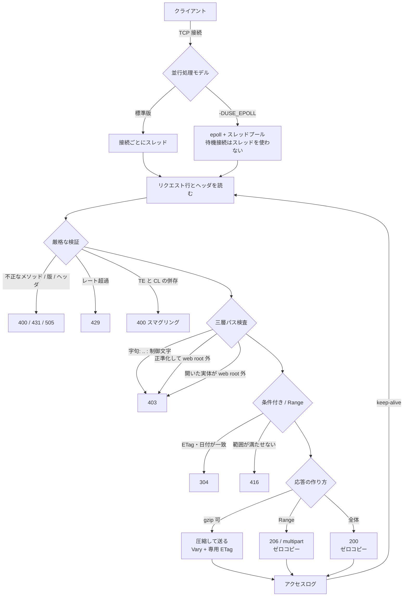

# tiny-httpd

[](https://github.com/Masah-111/tiny-httpd/actions/workflows/ci.yml)
[](LICENSE)
[](server.c)

**フレームワークを使わず、C言語で TCP ソケットから自作した HTTP/1.1 静的ファイルサーバ。**
Apache や nginx が内部で何をしているのかを、標準ライブラリだけで手を動かして理解するために作りました。
v0.2 で**セキュリティ・堅牢性**、v0.3 で**同時接続・keep-alive・キャッシュ・Range・ゼロコピー**まで実装し、
実運用サーバの主要機能をひと通り自作しています。

*A from-scratch HTTP/1.1 static file server in C — no frameworks. Adds hardened path validation, request-size limits & timeouts, optional TLS (OpenSSL), plus concurrency, keep-alive, conditional GET (304), byte ranges (206), standard headers, and zero-copy sends.*

---

## これは何か

ブラウザに `http://localhost:8080/` と打つと HTML が返ってくる、あの当たり前の仕組みを、
ライブラリに隠さずに全部自分で書いたものです。単一ファイル（[`server.c`](server.c)）。

```
ブラウザ ──TCP接続──> tiny-httpd
        ──"GET / HTTP/1.1"──>
        <──"HTTP/1.1 200 OK" + ヘッダ + HTML──
```

## 全体像

リクエストが通る道と、各段で何を弾いているか。



さらにその外側で、**Landlock サンドボックス**（Linux）がプロセス自体を web root の読み取りだけに閉じ込め、
**権限降格**で root 権限を捨て、**同時接続数の上限**と**I/O タイムアウト**が資源枯渇を防いでいる。

## 機能一覧

### 基本
| 機能 | 説明 |
|---|---|
| TCP ソケット | `socket()` → `bind()` → `listen()` → `accept()` を直接呼ぶ |
| IPv6 デュアルスタック | `AF_INET6` + `IPV6_V6ONLY=0` で IPv4/IPv6 の両方を1つのソケットで受ける |
| HTTP 解析 | リクエストライン（メソッド / パス / バージョン）をパース |
| GET / HEAD / OPTIONS | HEAD は本文なし。OPTIONS は `Allow` を返す（204）|
| リクエスト本文 | `Content-Length` と `Transfer-Encoding: chunked` の両方に対応 |
| ディレクトリ | 末尾スラッシュへ 301、`index.html` を自動配信、一覧は明示的に許可した場合のみ |
| gzip 圧縮 | `-DUSE_GZIP`。テキスト系のみ圧縮し、`Vary` と専用 ETag を付与 |
| 静的ファイル配信 | `./www` 以下のファイルを返す |
| Content-Type 判定 | 拡張子から MIME タイプを決定 |
| URLデコード | `%20` などを復元 |
| ステータス応答 | 200 / 204 / 206 / 304 / 400 / 403 / 404 / 405 / 413 / 416 / 431 / 505 |
| 厳格なリクエスト検証 | 不正メソッド・非対応バージョン(505)・ヘッダ行数上限(431)・obs-fold や `:`欠落の行(400)を拒否 |
| プロトコル版 | **HTTP/1.1** で応答。要求は HTTP/1.1 と HTTP/1.0 を受理し、それ以外は **505**。HTTP/1.1 で `Host` が無い、または `Host` が重複する要求は **400**（RFC 7230 5.4）|
| Winsock / POSIX 両対応 | Windows でも Linux/macOS でも動く |

### セキュリティ・堅牢性（v0.2 で強化）
| 機能 | 説明 |
|---|---|
| **多層パス検査** | ①字句検査（`..`・バックスラッシュ・**コロン**・制御文字・`%00` ヌル注入・**Windows予約デバイス名**を拒否）→ ②`realpath`/`_fullpath` で正準化し `www` 内かを検証 → ③**開いたハンドルで最終検証**（POSIX: `O_NOFOLLOW`＋`fstat` で TOCTOU とシンボリックリンクを封じる／Windows: reparse point 拒否＋`GetFinalPathNameByHandle` で“開いた実体の正準パス”を再検証しジャンクション脱出を封じる）。三層の多層防御 |
| **リクエストサイズ制限** | ヘッダが上限（8 KB）を超えたら **431**、本文が上限（1 MB）を超えたら **413** を返して切断（巨大 `Content-Length` でワーカーを占有させない）|
| **リクエストスマグリング対策** | `Transfer-Encoding` は未対応なので **400 で拒否**。`Content-Length` と併存させた TE.CL / CL.TE スマグリングの温床を断つ |
| **64bit ファイルサイズ** | サイズ・オフセットを 64bit で扱い、**2 GB 超のファイル**も正しく配信（Windows の `long` は 32bit のため要注意な箇所）|
| **タイムアウト** | recv/send に 10 秒のタイムアウトを設定。だらだら送り続ける **Slowloris 型 DoS** を遮断 |
| **キュー・バックプレッシャ** | epoll 版のワークキューに上限を設け、洪水時は接続を落として（load shedding）メモリ枯渇を防ぐ |
| **同時接続数の上限** | 現在の接続数をアトミックに数え、上限（既定 10000・環境変数 `TINYHTTPD_MAX_CONN` で変更可）を超えたら即クローズ |
| **graceful shutdown** | `SIGINT`/`SIGTERM` で新規受付を止め、listen ソケットを閉じてから綺麗に終了。`SIGPIPE` は無視して送信中の切断で落ちない |
| **権限降格 (POSIX)** | root で起動した場合、bind 後に `setgroups`/`setgid`/`setuid` で非特権ユーザ（既定 `nobody`）へ降格 |
| **per-IP レート制限** | IP ごとのトークンバケット。バーストは許容しつつ継続的な高頻度アクセスを抑え、枯渇時は **429** と `Retry-After` を返す |
| **Landlock サンドボックス** | Linux 5.13+ で、プロセスに「web root を読む以外できない」と宣言。パス検査をすり抜ける欠陥があってもカーネルが止める。起動時に `/` を開けないことを自己検証する |
| **TLS / HTTPS** | OpenSSL による TLS 終端（コンパイル時オプション `-DUSE_TLS`。TLS1.2 以上のみ許可） |

### 高度な機能（v0.3〜0.4・すべてテスト済み）
| 機能 | 説明 |
|---|---|
| **同時接続** | 標準版は接続ごとにスレッド（thread-per-connection）。さらに Linux 向けに **epoll + スレッドプール版（C10K エディション）** を用意（下記）|
| **keep-alive** | HTTP/1.1 の既定どおり、1本の接続で複数リクエストを処理。`Connection` ヘッダを尊重、アイドルは 10 秒でクローズ |
| **ボディ対応** | `Content-Length` を読んでリクエスト本文を処理。`POST /echo` は受け取った本文をそのまま返す（本文を確実に読めている証明） |
| **キャッシュ (304)** | `ETag` と `Last-Modified` を付与。`If-None-Match`（厳密一致）と `If-Modified-Since`（**日付を実際にパースして大小比較**）に **304** で応答。`Cache-Control` も送出 |
| **Range (206)** | 単一 `Range` は **206**、複数 `Range` は **multipart/byteranges** で返す。`If-Range`（表現が変われば全体を返す）対応。満たせない範囲は **416** |
| **標準ヘッダ** | `Date` / `Server` / `Accept-Ranges` / `Connection` などを RFC 準拠の形式で付与 |
| **ゼロコピー送信** | 平文・全体配信時は `TransmitFile`(Windows) / `sendfile`(Linux) でカーネル内送信。TLS や Range では通常送信へ自動フォールバック |

#### 攻撃をどう弾くか（テスト済みの例）
| リクエスト | 結果 | 防いだもの |
|---|---|---|
| `GET /../server.c` | 403 | 素の親ディレクトリ参照 |
| `GET /..%2fserver.c` | 403 | エンコードで隠した `/` |
| `GET /%2e%2e/server.c` | 403 | エンコードで隠した `..` |
| `GET /..\server.c` | 403 | バックスラッシュによる区切り偽装 |
| `GET /x%00.html` | 400 | ヌルバイト注入 |
| `GET /index.html::$DATA` | 403 | 代替データストリーム(ADS) |
| `GET /c:/windows/x` | 403 | ドライブ指定 |
| `GET /nul` `/con` `/com1` | 403 | Windows予約デバイス名 |
| `GET /escape/server.c`（junction経由）| 403 | ジャンクションによる webroot 脱出 |
| `Transfer-Encoding` + `Content-Length` | 400 | リクエストスマグリング（TE.CL / CL.TE）|
| `Host` ヘッダの重複 | 400 | どの権威宛か曖昧な要求（スマグリングの足がかり）|
| `Transfer-Encoding: gzip` | 501 | 未対応の転送コーディング |
| 1 MB 超の本文（`Content-Length`）| 413 | 巨大ボディによるワーカー占有 |
| 8 KB 超のヘッダ | 431 | ヘッダあふれ |
| 送信途中で沈黙 | 10 秒で切断 | Slowloris |

## ビルドと実行

### 平文 HTTP（依存ライブラリなし）

**Makefile を使う場合**
```bash
make            # 標準版
make epoll      # C10K 版（Linux）
make gzip       # gzip つき（要 zlib）
make tls        # TLS つき（要 OpenSSL）
make test       # 統合テスト
make asan       # ASan/UBSan つきビルド
make analyze    # 静的解析
```

**Windows（MinGW-w64 / gcc）**
```bash
gcc server.c -o server.exe -lws2_32 -lmswsock
./server.exe            # http://localhost:8080/
./server.exe 3000       # ポート変更
```
> `-lmswsock` はゼロコピー送信（`TransmitFile`）のリンクに必要。

**Linux / macOS / WSL**
```bash
gcc server.c -o server -lpthread
./server
```
> `-lpthread` は同時接続（スレッド）のリンクに必要。

### 設定（環境変数）

| 変数 | 既定 | 意味 |
|---|---|---|
| `TINYHTTPD_MAX_CONN` | 10000 | 同時接続数の上限 |
| `TINYHTTPD_RATE` | 50 | IP ごとの毎秒回復トークン数（レート制限）|
| `TINYHTTPD_BURST` | 100 | IP ごとのトークン上限。`0` で制限を無効化 |
| `TINYHTTPD_AUTOINDEX` | （無効）| `1` でディレクトリ一覧を有効化 |
| `TINYHTTPD_SANDBOX` | （有効）| `0` で Landlock サンドボックスを無効化 |
| `TINYHTTPD_USER` | `nobody` | root 起動時に降格する先のユーザ |

### HTTPS（TLS）を有効にする — OpenSSL が必要

> **注意:** TLS は OpenSSL ライブラリを使うため、環境に OpenSSL の開発パッケージが必要です。
> 標準の MinGW-w64 単体には入っていないので、**WSL / Linux か MSYS2 での有効化を推奨**します。

**1) OpenSSL を用意する**
- Linux / WSL: `sudo apt install libssl-dev openssl`
- MSYS2: `pacman -S mingw-w64-x86_64-openssl`

**2) TLS 付きでビルド**
```bash
# Linux / WSL / macOS
gcc server.c -o server -DUSE_TLS -lssl -lcrypto
# Windows(MSYS2)
gcc server.c -o server.exe -DUSE_TLS -lssl -lcrypto -lws2_32
```

**3) 自己署名証明書を作る（開発用）**
```bash
openssl req -x509 -newkey rsa:2048 -nodes -days 365 \
  -keyout key.pem -out cert.pem -subj "/CN=localhost"
```

**4) HTTPS で起動**
```bash
./server 8443 cert.pem key.pem      # https://localhost:8443/
```
> 自己署名証明書なのでブラウザは警告を出します（開発用途では想定どおり）。本番では
> Let's Encrypt などの正式な証明書を使います。
>
> ✅ **検証済み**: WSL(OpenSSL 3.0) 上で `curl -k` が **TLS 1.3** でハンドシェイクし、
> GET/POST(/echo)/Range(206)/条件付きGET(304) がすべて HTTPS 越しに動作することを確認。

## C10K エディション（epoll + スレッドプール・Linux 専用）

thread-per-connection は「接続数ぶんのスレッド」が必要で、1万接続だとメモリ・スケジューリングが破綻する
（これが有名な **C10K 問題**）。そこで Linux 向けに、`epoll` をリアクターにした版を用意した。

- **1つの `epoll` で listen ソケットと全クライアントを監視**。待機中の接続は epoll に預けるだけで
  スレッドを消費しない。
- クライアントは **`EPOLLONESHOT`** で登録し、「読み取り可能になった接続」だけを**ワークキュー**へ。
- **CPU コア数ぶんの固定ワーカースレッド**がキューから取り出し、1リクエスト処理して epoll に再武装。
- => 実際に I/O が来た接続だけがスレッドを使う。**待機接続が何万あってもスレッドは数個のまま**。

```bash
# Linux / WSL のみ（epoll は Linux 専用）
gcc server.c -o server_epoll -DUSE_EPOLL -lpthread
./server_epoll 8080
```

**実測（WSL2 / 12 コア）**: 500 本のアイドル keep-alive 接続を保持したまま新規リクエストは **9.9 ms** で応答。
そのときのサーバのスレッド数は **13**（= 12 ワーカー + epoll スレッド 1）。500 接続でもスレッドは 13 本で済む。

> ※このエディションは TLS 非対応（TLS はノンブロッキングなハンドシェイクが必要で、本エディションの
> スコープ外）。`-DUSE_EPOLL` と `-DUSE_TLS` の同時指定はビルド時にエラーにしている。

## 性能

[`tests/loadtest.sh`](tests/loadtest.sh) による実測（WSL2 / 12 コア、web root はネイティブ ext4 上、
`GET /` で 2.2KB の HTML を返す場合）。

| 条件 | スループット | 平均 | p50 | p95 | p99 |
|---|---|---|---|---|---|
| 1 接続（レイテンシ測定）| 2,830 req/s | **0.25 ms** | 0.23 ms | 0.46 ms | 0.76 ms |
| 50 接続 / thread-per-conn | 2,243 req/s | 19.9 ms | 17.4 ms | 45.4 ms | 63.5 ms |
| 50 接続 / epoll + pool | 2,537 req/s | 17.2 ms | 14.6 ms | 39.3 ms | 54.8 ms |
| 200 接続 / epoll + pool | 2,633 req/s | 26.1 ms | 21.4 ms | 63.2 ms | 89.4 ms |

> 高同時接続でのスループットが頭打ちになっているのは、負荷をかけている側（python の
> スレッドベースの計測スクリプト）が先に限界に達しているためで、サーバ側の上限ではない。
> 純粋なサーバ性能として意味があるのは 1 接続時のレイテンシ（0.25 ms）の方。

### 計測して見つけた性能バグ: Nagle と遅延 ACK

最初の計測では **1 リクエストあたり約 43 ms** もかかっていた。同時接続数を増やしても
1 リクエストの所要時間が変わらないことから、混雑ではなく固定の待ちだと分かった。

原因は **Nagle アルゴリズムと遅延 ACK の相互作用**だった。このサーバは応答を
「ヘッダを送る → 本文を送る」と 2 回に分けて書く。Nagle が有効だと 2 回目の小さな書き込みが
相手の ACK を待って保留され、相手は相手で遅延 ACK で待つため、数十 ms の膠着が生じる。

accept したソケットに `TCP_NODELAY` を設定して解消した。同一条件でこの 1 行だけを変えた比較:

| | 平均レイテンシ | スループット |
|---|---|---|
| `TCP_NODELAY` なし | 43.2 ms | 23 req/s |
| `TCP_NODELAY` あり | **0.23 ms** | **3,417 req/s** |

レイテンシで約 188 倍。「動いている」ことと「速い」ことは別問題で、測らないと分からないという
良い実例になった。

## 設計上の判断（面接で聞かれたら答えられるように）

- **パス検査をなぜ三段構えにしたか**: 字句チェック（`..`/コロン/予約名 拒否）だけだと、シンボリックリンクや
  OS ごとのパス解釈差、検査後の差し替え（TOCTOU）で抜ける余地が残る。そこで ①字句 → ②正準化して
  webroot 内か → ③**実際に開いたハンドルで最終検証**、と重ねた。特に③が重要で、「検査したパス」と
  「実際に読むファイル」を必ず同一実体に固定する（POSIX は `O_NOFOLLOW`＋`fstat`、Windows は
  `GetFinalPathNameByHandle` で開いた実体の正準パスを取り再検証）。これで **Windows のジャンクション経由の
  脱出**（`_fullpath` は字句解決なので見逃す）と **TOCTOU 競合**を実際に塞いだ。
- **タイムアウトを入れた理由**: 接続を確立したまま 1 バイトずつ極端に遅く送る Slowloris は、
  少ないリソースでサーバの接続枠を占有できる。recv タイムアウトで遅すぎる接続を切る。
- **TLS を自作しなかった理由**: 暗号は自作しないのが鉄則。実装ミスが即脆弱性になるため、
  枯れた OpenSSL に委ね、自分は「TLS 終端をどう組み込むか」の設計に集中した。
- **平文/TLS を `conn_t` で抽象化**: 読み書きを `conn_recv`/`conn_send_all` に集約し、
  平文と TLS を同じ処理系で扱えるようにした（分岐を最小化）。ゼロコピー送信もこの抽象の内側で
  「平文のときだけ」切り替えている。
- **同時接続に thread-per-connection を選んだ理由**: まず「複数接続を同時に捌く」直感的な形を
  Winsock/POSIX 両対応で実装するため。共有する可変状態を持たない設計（`g_webroot` 等は起動時確定の
  読み取り専用）なのでロック不要。数千接続規模では `epoll` 等のイベント駆動が必要になる（下記「今後」）。
- **keep-alive とボディ読み取りは表裏一体**: 1本の接続で次の要求を正しく切り出すには、
  前の要求の本文（`Content-Length` 分）を最後まで読み切る必要がある。だから静的サーバでも
  ボディの読み取りは必須だった。
- **epoll で `EPOLLONESHOT` を選んだ理由**: fd が一度発火したら再武装まで epoll が黙るので、
  「同じ接続を2つのワーカーが同時に触る」競合が起きない。ワーカーは1リクエスト処理して
  再武装するだけでよく、ロック設計が単純になる。
- **リクエスト処理を `handle_one_request` に切り出した理由**: thread-per-connection と
  epoll+pool の2方式で、HTTP の中身（解析・検査・応答）を1バイトも重複させないため。
  差し替わるのは「接続の捌き方」だけ。
- **IPv6 デュアルスタックにした理由**: `AF_INET6` の1ソケットで `IPV6_V6ONLY=0` にすると、
  IPv4 接続が IPv4-mapped（`::ffff:a.b.c.d`）として同じソケットに入る。Linux は既定で
  デュアルスタックだが **Windows は既定 v6only=1** なので、明示的に 0 を設定して両対応を保証している。
- **graceful shutdown で listen ソケットを閉じる理由**: `accept()` でブロック中でも、
  シグナルハンドラから listen ソケットを閉じれば `accept()` が即座にエラーで戻り、
  ループを安全に抜けられる（Windows でも同じ手が使える）。

## わかったこと / 学び

- HTTP は「TCP の上で決まった書式のテキストをやり取りしているだけ」だと体感できた。
- `recv()` は 1 回で全部読めるとは限らず、`\r\n\r\n` を検出するまでループが要る。
- 「入力は信用しない」— `..`、エンコード回避、ヌル注入、巨大ヘッダ、遅延送信…と、
  正常系より**異常系の設計**の方が難しく、そこが堅牢性の本質だと分かった。
- 暗号は「使う技術」であって「作る技術」ではない、という現場の判断基準を理解した。

## 今後の拡張（Future work）

- [x] ~~同時接続対応~~（v0.3: thread-per-connection で実装）
- [x] ~~HTTP keep-alive~~（v0.3 で実装）
- [x] ~~キャッシュ対応（ETag / Last-Modified / 条件付き GET）~~（v0.3 で実装）
- [x] ~~Range リクエスト~~（v0.3 で実装）
- [x] ~~`epoll` によるイベント駆動 + スレッドプール（C10K 対応）~~（v0.4 で実装・Linux）
- [ ] `kqueue`(BSD/macOS) / IOCP(Windows) 対応で C10K をクロスプラットフォーム化
- [ ] ノンブロッキング I/O による部分リクエストの状態機械化（Slowloris を 1 スレッドも使わず捌く）
- [ ] HTTP パイプライン対応
- [ ] gzip 圧縮（`Content-Encoding`）
- [ ] アクセスログのファイル出力・ログレベル

- **`TCP_NODELAY` を明示的に設定している理由**: 上の「計測して見つけた性能バグ」を参照。
  応答を 2 回に分けて書く以上、Nagle は有害になる。
- **gzip を全体一括で圧縮している理由**: ストリーミング圧縮にすると `Content-Length` を先に
  決められず chunked 応答が必要になる。上限（4MB）を超えるものは圧縮せずゼロコピーで送る、
  という単純な線引きにした。
- **ディレクトリ一覧を既定で無効にした理由**: 中身の一覧は情報漏洩になりうるので、
  明示的に `TINYHTTPD_AUTOINDEX=1` を指定したときだけ有効にしている（多くの実運用サーバと同じ既定）。

### 現状の既知の割り切り（正直に）
- epoll 版のワーカーは「読み取り可能」通知を受けてから**ブロッキングで**1リクエストを読む
  （`recv` タイムアウトで上限あり）。完全なノンブロッキング状態機械ではないので、極端に遅い
  1リクエストは1ワーカーを一時占有しうる。ただし**待機接続はスレッドを消費しない**ので
  C10K の本質（大量のアイドル接続）は解決できている。
- HTTP パイプライン（本文の後ろに次の要求を詰める）は未対応。
- `Expect: 100-continue` は未対応。応答は常に `Content-Length` を付けるため、chunked の
  「応答」は返さない（chunked の「要求本文」は解釈する）。
- HTTP/2・HTTP/3 は非対応（505 を返す）。HTTP/2 はバイナリフレーミングと HPACK、
  HTTP/3 は QUIC が土台で、1.1 の延長ではなく別実装になるため対象外にしている。
- `Transfer-Encoding: chunked` のリクエスト本文は未対応（安全のため 400 で拒否）。
- TLS はコンパイル時オプション（`-DUSE_TLS`）。WSL(OpenSSL 3.0) で **ビルド＆HTTPS を実機検証済み**（curl と **TLS 1.3** でハンドシェイクし、GET/POST/Range/条件付きGET が動作）。CI でもコンパイルを検証する。
- epoll 版は Linux 専用・TLS 非対応（`kqueue`/IOCP と非ブロッキング TLS は今後）。

## テスト / CI

```bash
bash tests/run_tests.sh              # 統合テスト（42 項目）
USE_EPOLL=1 bash tests/run_tests.sh  # epoll(C10K) 版に対して
bash tests/fuzz.sh                   # 不正リクエストを大量に投げて落ちないか
bash tests/loadtest.sh               # スループット / レイテンシ測定
```

| スクリプト | 内容 |
|---|---|
| [`tests/run_tests.sh`](tests/run_tests.sh) | **46 項目**の統合テスト。curl と raw ソケットで、ステータス（200/204/206/301/304/400/403/404/405/413/416/429/431/501/505）、multipart/byteranges、条件付きGET、If-Range、chunked 本文、ディレクトリ、gzip、IPv6、レート制限を検証。1 件でも失敗すれば非ゼロ終了 |
| [`tests/fuzz.sh`](tests/fuzz.sh) | ランダム・不正なリクエスト（壊れたメソッド／巨大ヘッダ／矛盾する長さ／ランダムバイト列）を大量に投げ、クラッシュしないことを確認。ASan/UBSan ビルドに対して実行すればメモリ破壊・未定義動作も検出する |
| [`tests/loadtest.sh`](tests/loadtest.sh) | 同時接続を張ってスループットと p50/p95/p99 レイテンシを測る（外部ツール不要）|

GitHub Actions（[`.github/workflows/ci.yml`](.github/workflows/ci.yml)）は push / PR ごとに以下を実行する。

- **ビルド 5 構成**（portable / epoll / gzip / TLS / 全部入り）を `-Werror` で
- **静的解析** `gcc -fanalyzer` を `-Werror` で（警告ゼロを維持）
- **統合テスト**を portable と epoll の両方で
- **ASan/UBSan** 下で統合テストとファジングを実行
- **HTTPS の疎通確認**（自己署名証明書を作り、GET/POST/Range を TLS 越しに検証）

## ライセンス
MIT
